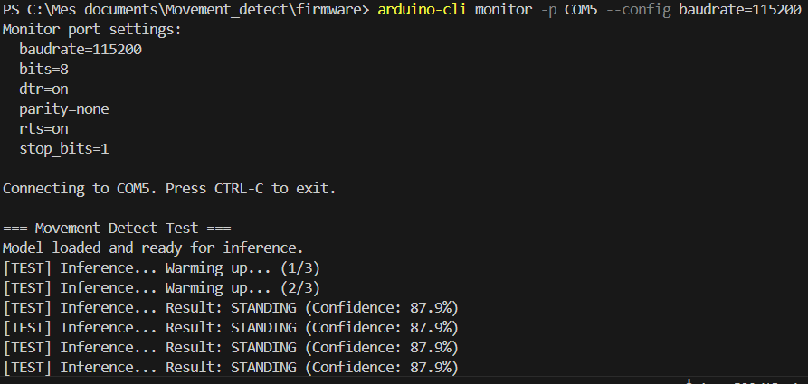

# Movement Detect

Détection de mouvements via intelligence artificielle sur microcontrôleur Raspberry Pi Pico W / ESP32.

## Description
Ce projet implémente une solution de reconnaissance d'activités humaines (Human Activity Recognition) à partir des données d'un accéléromètre. Le pipeline comprend l'entraînement d'un modèle CNN, sa quantification en INT8 et son déploiement sur un microcontroleur (Raspberry Pi Pico W et ESP32).

## Structure du projet
- `data/` : Jeu de données UCI HAR.
- `src/` : Scripts Python pour le pipeline ML.
  - `train_model.py` : Entraînement du modèle.
  - `export_model.py` : Conversion vers TFLite INT8.
  - `test_inference.py` : Validation de l'inférence.
- `models/` : Modèles sauvegardés et paramètres de normalisation.
- `firmware/` : Code source Arduino/C++ pour le microcontrôleur.

## Installation et Utilisation

### Pipeline ML
1. Installer les dépendances : `pip install -r requirements.txt`
2. Entraîner le modèle : `python src/train_model.py`
3. Exporter en TFLite : `python src/export_model.py`


### Firmware
Le dossier `firmware/` contient le code nécessaire pour faire tourner l'inférence sur le Pico W en utilisant TensorFlow Lite for Microcontrollers.

Avec le Raspberry Pi Pico 2W
```
cd firmware

# Compile the firmware
arduino-cli compile --fqbn rp2040:rp2040:rpipico2w --build-path .\build_pico --libraries .\libraries .

# Connect the board to the computer with the BOOTSEL button pressed
# Find the port of the board
arduino-cli board list

# Upload the firmware
Copy-Item .\build_pico\firmware.ino.uf2 D:\ # Replace D:\ with the drive letter of the board

# Monitor the serial output
arduino-cli monitor -p COM5 --config baudrate=115200 # Replace COM5 with the port of the board

```

## Test avec le Pico 2W : 

Avec un sample fixe (car je n'ai pas de capteur réel), mais sur la carte physique on a :



## Performances (TFLite INT8)
- har_baseline_6_target_sit.h5 : Précision TFLite INT8: 0.936
- har_baseline_7_target_sit.h5 : Précision TFLite INT8: 0.938
